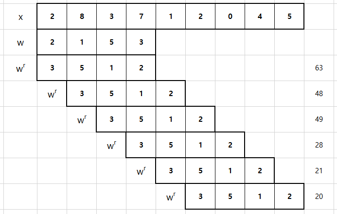
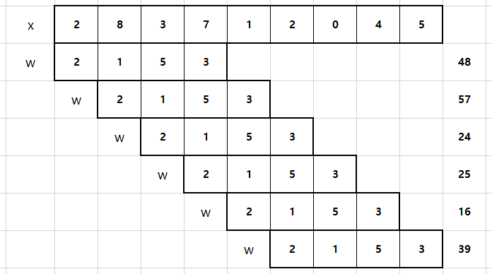
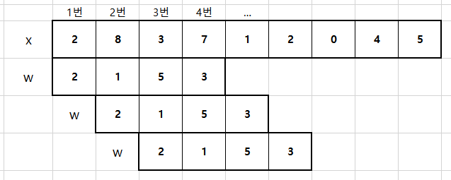
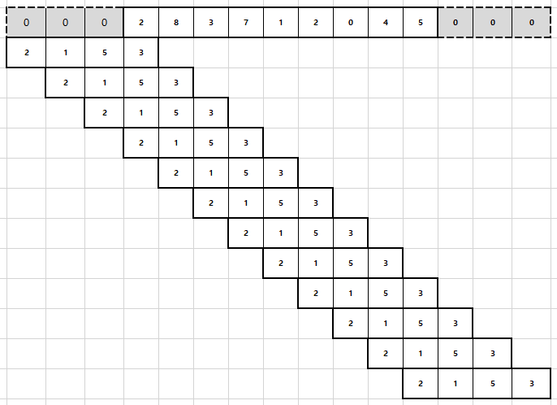
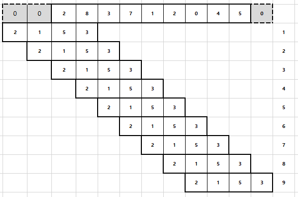
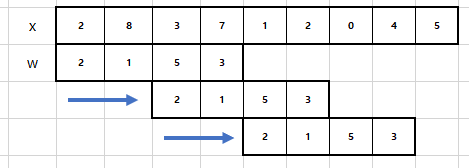
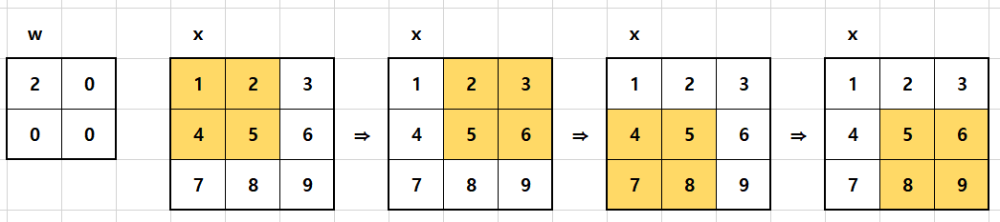
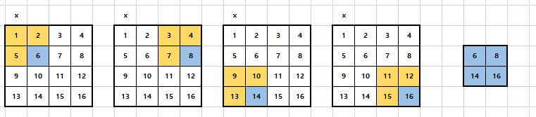
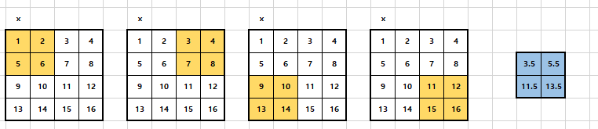
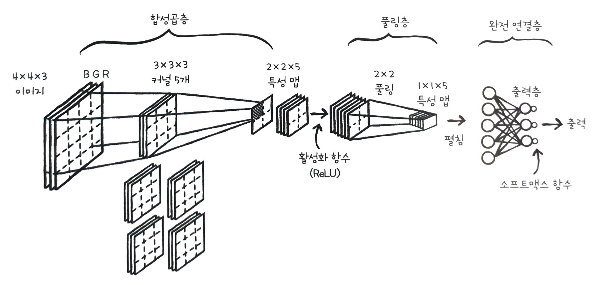

# Chapter 8. 이미지를 분류합니다. - 합성곱 신경망

## 08-1 합성곱 연산에 대해 알아봅니다.

### 합성곱을 그림으로 이해합니다.
합성곱은 두 함수에 적용하여 새로운 함수를 만드는 수학 연산자이다.  

합성곱은 수식으로 `x * w`와 같이 표기한다. 

### 합성곱 구현하기
#### 1. 넘파이 배열 정의하고 배열 하나 선택해 뒤집기
```python
import numpy as np
w = np.array([2, 1, 5, 3])
x = np.array([2, 8, 3, 7, 1, 2, 0, 4, 5])
# 배열 뒤집어주기 
w_r = np.flip(w)	# 넘파이의 flip() 함수 사용	
print(w_r) 
w_r = w[::-1]		# 슬라이스 연산자 사용
print(w_r) 
```
#### 2. 넘파이의 점 곱으로 합성곱 수행하기
x배열을 한칸씩 이동하면서 합성곱 수행하기
```python
for i in range(6):
	print(np.dot(x[i:i+4],w_r))
```
#### 3. 싸이파이로 합성곱 수행하기
싸이파이는 합성곱을 위한 함수 convolve()를 제공한다.
```python
from scipy.signal import convolve
convolve(x, w, mode='valid')
```
### 합성곱 신경망은 진짜 합성곱을 사용하지 않습니다.
사실 대부분의 딥러닝 패키지들은 합성곱 신경망을 만들 때 합성곱이 아니라 교차 상관을 사용한다.
#### 합성곱과 교차상관은 아주 비슷합니다
교차 상관은 합성곱과 동일한 방법으로 연산이 진행되지만 '미끄러지는 배열을 뒤집지 않는다'는 점이 다르다.  

교차 상관 역시 싸이파이의 correlate() 함수를 사용하면 간단히 계산 가능하다.                                                                                                                                                                                                                                                                                                                                                                                                                                             

```python
from scipy.signal import correlate
correlate(x, w, mode='valid')
```
#### 합성곱 신경망에서 교차 상관을 사용하는 이유를 알아봅니다
모든 모델은 훈련하기 전에 가중치 배열의 요소들을 무작위로 초기화한다.  
미끄러지는 배열이 가중치 배열에 해당하는데 이 배열은 무작위로 초기화되어있으므로 뒤집어서 합성곱을 적용하든지 뒤집지 않고 교차상관을 적용하든지 상관이 없다.  
하지만 합성곱 신경망이라는 이름이 관례적으로 널리 사용되어있기 때문에 합성곱 신경망이라는 용어를 사용한다.
### 패딩과 스트라이드를 이해합니다.
패딩(padding)은 원본 배열의 양 끝에 빈 원소를 추가하는 것을 말한다.   
스트라이드(stride)는 미끄러지는 배열의 간격을 조절하는 것을 말한다. 
#### 밸리드 패딩은 원본 배열의 원소가 합성곱 연산에 참여하는 정도가 서로 다릅니다
밸리드 패딩은 원본 배열에 패딩을 추가하지 않고 미끄러지는 배열이 원본 배열의 끝으로 갈 때까지 교차상관을 수행한다.  
그래서 밸리트 패딩의 결과로 얻는 배열의 크기는 원본 배열보다 항상 작다.  
밸리드 패딩의 특징은 원본 배열의 각 원소가 연산에 참여하는 정도가 다르다는 것이다. 

밸리드 패딩은 원본 배열 양 끝 원소의 연산 참여도가 낮다.

```python
correlate(x, w, mode='valid')
```
#### 풀 패딩은 원본 배열 요소의 연산 참여도를 동일하게 만듭니다
원본 배열의 원소들이 연산에 동일하게 참여하도록 원본 배열의 양 끝에 가상의 원소를 추가해준다.  
가상의 원소로 0을 사용하기때문에 제로 패딩이라고 부른다. 


```python
correlate(x, w, mode='full')
```
#### 세임 패딩은 출력 배열의 길이를 원본 배열의 길이와 동일하게 만듭니다
출력 배열의 길이가 원본 배열의 길이와 같아지도록 원본 배열에 제로 패딩을 추가한다. 


```python
correlate(x, w, mode='same')
```
합성곱 신경망에서는 대부분 세임 패딩을 사용한다.
#### 스트라이드는 미끄러지는 간격을 조정합니다
스트라이드는 미끄러지는 배열의 간격을 말한다.  
지금까지는 스트라이드를 1로 지정하여 모두 1칸씩 미끄러지며 연산을 수행했다.  
만약 스트라이드를 2로 지정하면 2칸씩 미끄러지며 연산을 수행한다. 

합성곱 신경망을 만들 때에는 보통 스트라이드를 1로 지정한다.  
합성곱 신경망은 대부분 2차원 배열에 대한 합성곱을 사용한다. 

### 2차원 배열에서 합성곱을 수행합니다.
합성곱의 수행 방행은 원본 배열의 왼쪽에서 오른쪽으로, 위에서 아래쪽으로 1칸씩 이동하며 배열 원소끼리 곱한다. 

원본 배열의 크기가 3 × 3이므로 밸리드 패딩을 하면 미끄러지는 배열이 이동하는 횟수는 총 4번이다.  
싸이파이의 correlate2d() 함수를 사용하여 2차원 배열의 합성곱을 계산할 수 있다. 
```python
from scipy.signal import correlate2d
x = np.array([[1, 2, 3],
              [4, 5, 6],
              [7, 8, 9]])
w = np.array([[2, 0], [0, 0]])
correlate2d(x, w, mode='valid')
```
--> colab  
세임 패딩의 경우 오른쪽과 아래쪽 모서리에 제로 패딩이 추가된다.  

세임패딩을 사용했기 때문에 원본 배열의 크기가 같은 출력 배열이 만들어진다.
--> colab
```python
correlate2d(x, w, mode='same')
```
스트라이드의 경우 미끄러지는 방향은 그대로 유지하면서 미끄러지는 간격의 크기만 커진다.
### 텐서플로로 합성곱을 수행합니다.
지금부터는 합성곱 신경망을 기준으로 설명하므로 원본 배열은 입력이라 부르고 미끄러지는 배열은 가중치라고 한다.
#### 합성곱 신경망의 입력은 일반적으로 4차원 배열입니다
텐서플로에서 2차원 합성곱을 수행하는 함수는 conv2d()이다.  
conv2d()는 입력 이미지의 높이와 너비 외에 더 많은 차원이 필요하기 때문에 입력으로 4차원 배열을 기대한다.

입력에는 2개의 샘플이 포함되어있으며 각샘플은 R, G, B로 구분되는 3개의 컬러 채널을 갖고 있다.  
위 입력을 4차원 배열로 표현하면 (2, 3, 3, 3)이며 각각의 숫자는 (배치, 샘플이 높이, 샘플의 너비, 컬러채널의 차원) 을 의미한다.  
입력과 곱해지는 가중치도 4개의 차원으로 구성되고 (2, 2, 3, 3) 으로 표현되는데 각각의 숫자는 (가중치의 높이, 가중치의 너비, 채널, 가중치의 개수) 를 의미한다.  
입력과 가중치에 세임 패딩을 적용하여 합성곱을 수행하면  
(입력의 배치, 입력의 높이, 입력의 너비, 가중치의 개수) 가 된다.  
#### 2차원 배열을 4차원 배열로 바꿔 합성곱을 수행합니다. 
텐서플로는 4차원 배열의 입력을 기대하기때문에 앞에서의 입력 x와 가중치 w를 넘파이의 reshape() 메소드로 2차원 배열에서 4차원 배열로 바꾼다.  
또한 텐서플로는 실수형의 입력을 기대하기 때문에 넘파이의 astype() 메소드로 입력의 자료형을 실수로 바꾼다.  
배치와 컬러 채널은 1
```python
import tensorflow as tf
x_4d = x.astype(np.float).reshape(1, 3, 3, 1)   # 4차원 배열로 바꾸고 실수형으로 바꾸기
w_4d = w.reshape(2, 2, 1, 1)                    # 4차원 배열로 바꾸기
```
스트라이드는 1, 패딩은 세임 패딩
```python
c_out = tf.nn.conv2d(x_4d, w_4d, strides=1, padding='SAME')
```
conv2d 함수는 텐서플로의 Tensor 객체를 리턴한다.  
(Tensor는 텐서플로에서 다차원 배열을 부르는 것)  
Tensor 객체의 numpy() 메소드를 이용해서 넘파이 배열로 변환해주는데 편의상 배치 차원과 컬러 차원을 제거하고 (3, 3) 크기로 변환하자.
```python
c_out.numpy().reshape(3, 3)
```
### 패션 MNIST 데이터 세트를 합성곱 신경망에 적용하면 어떻게 될까요?
07장과 다르게 합성곱 신격망에서는 28×28 입력을 펼치지 않고 그대로 사용해서 3×3 또는 5×5 크기의 가중치로 합성곱을 적용한다.  
가중치 배열의 크기는 작아졌고 입력의 특징을 더 찾기 때문에 합성곱 신경망이 이미지 분류에서 뛰어난 성능을 발휘할 수 있다.
### 이 책에서는 합성곱의 가중치를 필터 또는 커널이라고 부릅니다.
종종 다른 책이나 라이브러리에서는 합성곱의 가중치를 필터 또는 커널이라고 부르고, 텐서플로의 케라스에서는 커널이라고 부른다.  
이 책에서는 합성곱의 필터 1개를 지칭할 때에는 커널이라고 하고, 필터 전체를 지칭할 때에는 일반 신경망과 동일하게 가중치라고 할것이다.
## 08-2 풀링 연산에 대해 알아봅니다.
합성곱 신경망에서는 합성곱이 일어나는 층을 합성곱층, 풀링이 일어나는 층을 풀링층이라고 부른다.  
합성곱층과 풀링층에서 만들어진 결과를 특성맵(feature map)이라고 부른다.  

입력이 합성곱층을 통과할 때 합성곱과 활성화 함수가 적용되어서 특성 맵이 만들어진다.  
그 다음 특성맵이 풀링층을 통과하여 다른 특성 맵이 만들어진다.  
이렇게 합성곱층 뒤에 풀링층이 따라오는 형태가 합성곱 신경망의 전형적인 모습이다.  
**풀링** 이란 특성 맵을 스캔하여 최댓값을 고르거나 평균값을 계산하는 것을 말한다.   
합성곱 신경망에서는 주로 최대 풀링과 평균 풀링을 주로 사용한다. 
### 최대 풀링에 대해 알아봅니다
**최대 풀링** 은 특성 맵 위를 스캔하며 최댓값을 고른다.  
풀링 영역의 크기는 보통 2×2를 지정하고 스트라이드는 풀링의 한 모서리 크기로 지정한다.  
즉 풀링 영역이 겹치지 않게 스캔한다. 

2×2 풀링은 특성맵의 크기를 절반으로 줄인다. (면적은 1/4)  
특성 맵의 크기를 절반으로 줄이면 특성 맵의 한 요소가 입력의 더 넓은 영역을 바라볼 수 있는 효과를 얻을 수 있다.  
예를 들면 위 그림에서 각 영역의 최댓값인 6, 8, 14, 16은 그 영역을 대표한다. 
### 평균 풀링에 대해 알아봅니다.
**평균 풀링** 은 풀링 영역의 평균값을 계산한다.  

연구자들은 보통 평균 폴링보다 최대 풀링을 선호하는데 그 이유는 평균 폴링은 합성곱층을 통과하는 특징들을 희석시킬 가능성이 높기 때문이다.  
하지만 최대 풀링은 가장 큰 특징을 유지시키는 성질이 있기 때문에 이미지 분류 작업에 알맞다.

### 최대 풀링과 평균 풀링을 수행합니다.
텐서플로의 max_pool2d() 함수를 사용하면 최대 풀링을 수행할 수 있다.  
먼저 4×4 크기의 배열을 만든 다음 1×4×4×1 크기의 배열로 변형한다. 
```python
x = np.array([[1, 2, 3, 4], 
              [5, 6, 7, 8], 
              [9, 10, 11, 12], 
              [13, 14, 15, 16]])
x = x.reshape(1, 4, 4, 1)
```
max_pool2d()에서 풀링의 크기를 ksize 매개변수에, 스트라이드 크기를 strides 매개변수에 지정한다.
```python
p_out = tf.nn.max_pool2d(x, ksize=2, strides=2, padding='VALID')
p_out.numpy().reshape(2, 2)   # numpy 배열로 변환한 후 2차원 배열로 변형
```
풀링층에는 학습되는 가중치가 없다.   
또한 풀링은 배치차원이나 채널 차원으로 적용되지 않는다.  
즉, 풀링층을 통과하기 전후로 배치 크기와 채널 크기는 동일하다.
## 08-3 합성곱 신경망의 구조를 알아봅니다.
### 렐루 함수에 대해 알아봅니다.
**렐루(ReLU)함수** 는 합성곱 신경망에서 자주 사용하는 활성화 함수이다.  

이전까지는 은닉층에 시그모이드 함수를 활성화 함수로 사용했고,   
출력층은 이진분류일 경우에는 시그모이드 함수, 다중분류일 경우에는 소프트맥스 함수를 사용했다.  
렐루 함수는 주로 합성곱층에 적용되는 활성화 함수로 합성곱 신경망의 성능을 더 높여준다.  
$$
y =\begin{cases}x & (x > 0)\\0 & (x  \leq  0)\end{cases}
$$
### 렐루 함수 구현하기
렐루 함수는 넘파이의 maximum() 함수를 사용하면 간단하기 구현할 수 있다.  
```python
def relu(x):
	return np.maximum(x, 0)
```
텐서플로가 제공하는 렐루함수는 relu()인데 Tensor 객체를 반환하므로 화면출력을 위해서는 넘파이로 변환해야 한다.
### 렐루 함수의 도함수를 알아봅니다.
렐루함수의 도함수는 입력이 0보다 크면 1이고 (y와 x의 값이 같으므로) 입력이 0보다 작으면 0이다. (항상 0이므로)  
$$
y =\begin{cases}1 & (x > 0)\\0 & (x  \leq  0)\end{cases}
$$
사실 렐루함수같은 그래프는 x= 0에서 미분가능하지않은 함수이긴 하지만 대부분의 딥러닝 패키지는 x = 0인 경우 도함수를 0으로 생각한다. (이렇게 해도 실전에서 잘 작동함)
### 합성곱 신경망에서 일어나는 일들과 구조를 알아봅니다.
#### 합성곱 신경망에 주입될 입력 데이터에는 채널이 있습니다
합성곱 신경망은 이미지의 2차원 형태를 입력으로 그대로 사용하므로 이미지 정보가 손상되지 않는다는 장점이 있다.  
한가지 고려할 점은 이미지는 채널이라는 차원을 하나 더 가진다는 것인데 채널은 이미지의 픽셀이 가진 색상을 표현하기 위해 필요한 정보를 말한다.  
색상은 빨간색, 파란색, 초록색의 조합으로 표현할 수 있으며 이를 RGB라고 부른다.

#### 합성곱층에서 일어나는 일을 알아봅니다
이미지의 모든 채널에 합성곱이 한번에 적용되어야 하므로 커널의 마지막 차원은 입력 채널의 개수와 동일해야 한다.  
각 커널의 크기는 보통 3×3 또는 5×5이다.  
만약 3×3 크기의 커널을 사용하고 이미지가 4×4×10의 구조를 가지고 있다면 (10개의 채널을 가진 이미지) 커널 배열의 크기도 3×3×10으로 마지막 차원의 개수를 동일하게 맞추어야 한다.

이미지와 커널이 준비되면 합성곱을 수행한다.  
합성곱이 완료되면 다음 층에서 사용하게 될 특성 맵이 만들어진다.  
위의 예에서는 합성곱을 4번 수행하므로 2×2의 특성맵이 만들어진다.  
만약 이미지의 여러 특징을 감지하려면 커널을 여러개 사용해야 한다. 
#### 풀링층에서 일어나는 일을 알아봅니다
합성곱층을 통해서 만들어진 특성맵에 활성화함수로 렐루 함수를 적용하고 풀링을 적용한다.  
풀링을 적용하게 되면 특성 맵의 크기는 절반으로 줄어들지만 당연히 채널의 크기는 줄어들지 않는다.  
### 특성 맵을 펼쳐 완전 연결 신경망에 주입합니다.

일반적으로 합성곱층과 풀링층을 통과시켜 얻은 특성 맵은 일렬로 펼쳐 완전 연결층에 입력으로 주입한다.  
완전 연결층의 출력은 출력층의 뉴런과 연결되는데 합성곱층이 찾은 특성을 사용하여 최종 분류 단계를 수행하는 과정으로 볼 수 있다.  
이 다음에는 출력층과 다중 분류를 위한 소프트 맥스 함수를 통과하여 최종 출력을 만들게 된다.

## 08-4 합성곱 신경망을 만들고 훈련합니다.
지금까지는 순수 파이썬만으로 신경망을 구현해 왔지만 합성곱 신경망을 순수 파이썬만으로 구현하기에는 코드가 복잡해지기때문에 텐서플로가 제공하는 합성곱 함수와 자동 미분 기능을 사용해서 구현하도록 한다. 
### 합성곱 신경망의 전체 구조를 한번 더 살펴보세요
- 합성곱: 28×28 크기의 흑백 이미지, 3×3 크기의 커널 10개
- 풀링: 2×2 크기의 최대 풀링을 수행해서 14×14×10으로 특성 맵의 크기 줄인다. 
- 특성맵을 일렬로 펼쳐서 100개의 누런을 가진 완전 연결층과 연결시킨다.
- 10개의 클래스를 구분하기 위한 소프트맥스 함수를 연결한다. 
### 합성곱 신경망의 정방향 계산 구현하기
#### 1, 합성곱 적용하기
conv2d() 함수를 통해 합성곱을 수행한 다음에 절편 self.conv_b를 더해야 한다.  
절편은 커널마다 1개씩 필요하다.  
conv2d() 함수의 결과로 만들어지는 특성맵의 크기는 28×28×10이다.  
크기가 10인 1차원 배열 self.conv_b는 자동으로 conv2b() 함수의 결과의 마지막 차원에 브로드캐스팅된다. 
```python
def forpass(self, x):
	# 3×3 합성곱 연산을 수행한다. 
	c_out = tf.nn.conv2d(x, self.conv_w, strides=1, padding='SAME') + self.conv_b
```
conv2d() 함수에 전달한 매개변수
- self.conv_w: 합성곱에 사용할 가중치. 3×3×1 크기의 커널을 10개 사용하기 때문에 전체 크기는 3×3×1×10이다.
- stride, padding: 특성 맵의 가로와 세로 크기를 일정하게 만들기 위하여 stride는 1, padding은 'SAME'으로 했다. 
#### 2. 렐루 함수 적용하기
합성곱 계산 후에 렐루함수를 적용해서 합성곱층을 완성한다.  
```python
def forpass(self, x):
	...
	# 렐루 함수를 적용합니다.
	r_out = tf.nn.relu(c_out)
	...
```
#### 3. 풀링 적용하고 완전 연결층 수정하기
max_pool2d() 함수를 사용해서 2×2 크기의 풀링을 적용한다.  
이 단계에서 만들어진 특성 맵의 크기는 14×14×10이다.  
그 다음 tf.reshape함수를 이용해서 일렬로 펼치는데 이때 배치 차원을 제외한 나머지 차원만 별쳐야 한다.  

그 다음 코드는 완전 연결층에 해당한다. 
conv2d()와 max_pool2d() 등의 함수가 Tensor 객체를 반환하기 때문에 np.dot() 함수를 tf.matmul() 함수로 바꾸었다.  
또한 활성화 함수도 시그모이드 함수 대신 렐루 함수를 사용했다.  
```python
def forpass(self, x):
	...
	# 2×2 최대 풀링을 적용한다. 
	p_out = tf.nn.max_pool2d(r_out, ksize=2, strides=2, padding='VALID')
	# 첫번째 배치 차원을 제외하고 출력을 일렬로 펼친다.
	f_out = tf.reshape(p_out[x.shape[0], -1])
	z1 = tf.matmul(f_out, self.w1) + self.b1	# 첫번째 층의 선형식을 계산
	a1 = tf.nn.relu(z1)							# 활성화 함수 적용
	z2 = tf.matmul(a1, self.w2) + self.b1		# 두번째 층의 선형식을 계산
	...
```
### 합성곱 신경망의 역방향 계산 구현하기
역방향 계산을 직접 구현하는 대신 텐서플로의 자동 미분(automatic differentiation)기능을 사용한다.
#### 자동 미분의 사용 방법을 알아봅니다
딥러닝 패키지들은 사용자가 작성한 연산을 계산 그래프 (computation graph)로 만들어 자동 미분 기능을 구현한다.  
자동 미분 기능을 사용하면 임의의 파이썬 코드나 함수에 대한 미분값을 계산할 수 있다.

자동 미분 기능을 사용하려면 with 블럭으로 tf.GradientTape() 객체가 감시할 코드를 감싸야 한다.  
tape 객체는 with 블럭 안에서 일어나는 모든 연산을 기록하고 텐서플로 객체인 tf.Variable 객체를 자동으로 추적한다. 
그래디언트를 계산하려면 미분 대상 객체와 변수를 tape객체의 gradient() 메서드에 전달하면 된다. 
```python
x = tf.Variable(np.array([1.0, 2.0, 3.0]))
with tf.GradientTape() as tape:
  y = x ** 3 + 2 * x + 5

# 그래디언트를 계산
print(tape.gradient(y, x))
```
#### 1. 역방향 계산 구현하기
자동 미분 기능을 사용하면 ConvolutionNetwork의 backprop() 메소드를 구현할 필요가 없다. 
```python
def training(self, x, y):
	m = len(x)					# 샘플 개수를 저장한다. 
	with tf.GradientTape() as tape:
		z = self.forpass(x)		# 정방향 계산을 수행한다
		# 손실을 계산한다.
		loss = tf.nn.softmax_cross_entropy_with_logists(y, z)
		loss = tf.reduce_mean(loss)
	...
```
#### 2. 그래디언트 계산하기
가중치와 절편을 업데이트한다.  
tape.gradient() 메소드로 그래디언트를 계산한다.  
텐서플로는 여러 종류의 경사 하강법 알고리즘을 클래스로 미리 구현해두었는데 이 알고리즘들을 바꾸어 가며 테스트할 때 가중치를 업데이트 하는 코드를 일일이 고쳐야 하는 것은 번거로우니까 텐서플로의 옵티마이저를 사용해주면 간단하게 테스트할 수 있다.  
apply_gradients() 메서드에는 그레디언트와 가중치를 튜플로 묶은 리스트를 전달해야 하는데 여기서는 zip 반복자를 사용해서 구현했다. 
```python
def training(self, x, y):
	...
	weights_list = [self.conv_w, self.conv_b, self.w1, self.b1, self.w2, self.b2]
	# 가중치에대한 그래디언트 계산
	grads = tape.gradient(loss, weights_list)
	# 가중치를 업데이트
	self.optimizer.apply_gradients(zip(grads, weights_list))
```
### 옵티마이저 객체를 만들어 가중치 초기화하기
training() 메소드에 등장하는 self.optimizer를 fit 객체에서 만든다.  
확률적 경사 하강법을 사용한다. 
#### 1. fit() 메소드 수정하기
텐서플로에는 tf.optimizers 모듈 아래에 여러 종류의 경사 하강법이 구현되어 있다.  
SGD 옵티마이저 (tf.optimizer.SGD) 객체는 기본 경사 하강법이다.  
```python
def fit(self, x, y, epochs = 100, x_val = None, y_val = None):
	self.init_weights(x.shape, y.shape[1])	# 은닉층과 출력층의 가중치를 초기화
	self.optimizer = tf.optimizers.SGD(learning_rate = self.lr)
	# epochs만큼 반복
	for i in range(epochs):
		print('에포크', i, end = '')
		# 제너레이터 함수에서 반환한 미니배치를 순환
		batch_losses = []
		for x_batch, y_batch in self.gen_batch(x, y):
			print('.', end = '')
			self.training(x_batch, y_batch)
			# 배치 손실을 기록한다. 
			batch_losses.append(self.get_loss(x_batch, y_batch))
		print()
		# 배치 손실 평균을 내어 훈련 손실값으로 저장한다. 
		self.losses.append(np.mean(batch_losses))
		# 검증 세트에 대한 손실을 계산한다.
		self.val_losses.append(self.get_loss(x_val, y_val))
```
#### 2. init_weights() 메소드 수정하기
가중치를 초기화하는 메소드이다.  
가중치를 glorot_uniform() 함수로 초기화한다는 점과 텐서플로의 자동 미분 기능을 이용하기 위해서 가중치를 tf.Variable() 함수로 만들어야 한다는 점이 이전과 다른 점이다.  
합성곱의 가중치와 완전 연결층의 가중치를 tf.Variable 함수로 선언할 때 입력값에 따라 자료형이 자동으로 결정된다.  
np.zeros() 함수는 기본적으로 64비트 실수를 만들기 때문에 절편 변수를 가중치 변수와 동일하게 32비트 실수로 맞추기 위해서 dtype 매개변수에 float를 지정했다. 
```python
def init_weights(self, input_shape, n_classes):
	g = tf.initializers.glorot_uniform()
	self.conv_w = tf.Variable(g((3, 3, 1, self.n_kernels)))
	self.conv_b = tf.Variable(np.zeros(self.n_kernels), dtype=float)
	n_features = 14*14*self.n_kernels
	self.w1 = tf.Variable(g((n_features, self.units)))		# (특성 개수, 은닉층의 크기)
	self.b1 = tf.Variable(np.zeros(self.units), dtype=float)# 은닉층의 크기
	self.w2 = tf.Variable(g((self.units, n_classes)))		# 은닉층의 크기, 클래스 개수
	self.b2 = tf.Variable(np.zeros(n_classes), dtype=float)	# 클래스 개수
```
### glorot_uniform()을 알아봅니다.
glorot_uniform() 함수는 가중치를 초기화할 때 글로럿 초기화하는 방법을 사용할 수 있게 해 준다  .
가중치를 적절하게 초기화하지 않으면 출발점이 적절하지 않은 곳에 설정되므로 엉뚱한 곳에서 최적점이라는 판단을 내릴 수도 있다.  
이렇게 찾은 지점을 지역 최적점이라고 한다.  
가중치를 적절하게 초기화해서 찾은 최적점은 전역 최적점이라고 한다. 
#### 글로럿 초기화 방식으로 가중치를 초기화합니다
글로럿 초기화 방식은 세이비러 글로럿이 제안하여 사용되는 가중치 초기화 방식이다.  
텐서플로의 glorot_uniform() 함수는 ±√(6/입력 뉴런 수 + 출력 뉴런 수) 범위에서 균등하게 난수를 발생시켜 가중치를 초기화한다. 
### 합성곱 신경망 훈련하기
#### 1. 데이터 세트 불러오기
```python
(x_train_all, y_train_all), (x_test, y_test) = tf.keras.datasets.fashion_mnist.load_data()
```
#### 2. 훈련 데이터 세트를 훈련 세트와 검증 세트로 나누기
```python
from sklearn.model_selection import train_test_split
x_train, x_val, y_train, y_val = train_test_split(x_train_all, y_train_all, stratify=y_train_all, test_size=0.2, random_state=42)
```
#### 3. 타깃을 원-핫 인코딩으로 변환하기
합성곱 신경망의 타깃으로 사용하려면 y_train, y_val 배열의 요소들을 원-핫 인코딩으로 변경해야 한다.
```python
y_train_encoded = tf.keras.utils.to_categorical(y_train)
y_val_encoded = tf.keras.utils.to_categorical(y_val)
```
#### 4. 입력 데이터 준비하기
합성곱 신경망은 입력데이터의 높이와 너비 차원을 그대로 유지한 채 신경망에 주입할 수 있지만 마지막에 컬러 채널을 추가해야 한다.  
흑백 이미지에는 컬러 채널이 없지만 명암을 나타내는 1차원 채널이 있다고 가정한다.
```python
x_train = x_train.reshape(-1, 28, 28, 1)
x_val = x_val.reshape(-1, 28, 28, 1)
x_train.shape
```
#### 5. 입력 데이터 표준화 전처리하기
입력 데이터를 255로 나누어 0~1사이의 값으로 조정한다. 
```python
x_train = x_train / 255
x_val = x_val / 255
```
#### 6. 모델 훈련하기
합성곱 커널 10개 완전 연결층의 뉴런 100개, 배치 크기 128개, 학습률 0.01로 지정하여 모델을 훈련한다. 
```python
cn = ConvolutionNetwork(n_kernels=10, units=100, batch_size=128, learning_rate=0.01)
cn.fit(x_train, y_train_encoded, x_val=x_val, y_val=y_val_encoded, epochs=20)
```
#### 7. 훈련, 검증 손실 그래프 그리고 검증 세트의 정확도 확인하기
검증 세트에 대한 정확도를 측정하면 88%에 가깝다.
```python
import matplotlib.pyplot as plt

plt.plot(cn.losses)
plt.plot(cn.val_losses)
plt.ylabel('loss')
plt.xlabel('interation')
plt.legend(['train_loss', 'val_loss'])
plt.show()
```
## 08-5 케라스로 합성곱 신경망을 만듭니다.
### 케라스로 합성곱 신경망 만들기
케라스의 함성곱층은 Con2D클래스이다.  
최대 풀링은 MaxPooling2D클래스를 사용하고, 특성 맵을 일렬로 펼치 때는 Flatten 클래스를 사용한다. 
#### 1. 필요한 클래스들을 임포트하기

```python
from tensorflow.keras.layers import Conv2D, MaxPooling2D, Flatten, Dense
```
#### 2. 합성곱층 쌓기
Conv2D 클래스의 첫번째 매개변수는 합성곱 커널의 개수, 두번째 매개변수는 합성곱 커널의 크기로 높이와 너비를 튜플로 전달한다.  
activation 매개변수에는 렐루 활성화 함수를 지정하고, 패딩은 세임 패딩을 사용하는데 이번에는 대소문자를 구분하지 않는다.  
Sequential 클래스에 층을 처음 추가할때는 배치 차원을 제외한 입력의 크기를 지정한다.  
여기서는 패션 MNIST 이미지의 높이와 너비, 컬러 채널이 입력의 크기가 된다. 
```python
conv1 = tf.keras.Sequential()
conv1.add(Conv2D(10, (3, 3), activation='relu', padding='same', input_shape=(28, 28, 1)))
```
#### 3. 풀링층 쌓기
MaxPooling2D 클래스의 첫번째 매개변수: 풀링의 높이와 너비를 나타내느 튜플  
스트라이드는 strides 매개변수에 지정하고 기본값은 풀링의 크기이다.  
패딩은 padding 매개변수에 지정하고 기본값은 'vaild' 이다.  
여기서는 스트라이드와 패딩의 기본값을 사용한다. 
```
conv1.add(MaxPooling2D((2, 2)))
```
#### 4. 완전 연결층에 주입할 수 있도록 특성 맵 펼치기
배치차원을 제외하고 일렬로 펼치는 작업은 Flatten 클래스로 할 수 있다.  
```
conv1.add(Flatten())
```
#### 5. 완전 연결층 쌓기
첫번째 완전 연결층에는 100개의 뉴런을 사용하고 렐루 활성화 함수를 적용한다.  
마지막 출력층에는 10개의 클래스에 대응하는 10개의 뉴런을 사용하고 소프트맥스 활성화 함수를 적용한다. 
```
conv1.add(Dense(100, activation='relu'))
conv1.add(Dense(10, activation='softmax'))
```
#### 6. 모델 구조 살펴보기
모델의 summary() 메소드를 사용하면 conv1 모델의 구조를 조사할 수 있다.  
```
conv1.summary()
```
합성곱층의 출력 크기에서 배치차원이 None인데 그 이유는 훈련할 때 전달되는 샘플 개수에 따라 배치 입력의 개수가 달라지기 때문이다.  
가중치의 개수를 보면 완전 연결층에 비해 합성곱층의 가중치 개수가 아주 적은데 그렇게 때문에 합성곱층을 여러 개 추가해도 학습할 모델 파라미터의 개수가 크게 늘지 않기 때문에 계산 효율성이 좋다. 
### 합성곱 신경망 모델 훈련하기
#### 모델 훈련하기 
정확도를 관찰하기 위해서 metrics 매개변수에 'accuracy'를 리스트로 전달했다.
```
conv1.compile(optimizer='adam', loss='categorical_crossentripy', metrics=['accuracy'])
```
#### 2. 아담 옵티마이저 사용하기
이번에는 적응적 학습률 알고리즘 중 하나인 아담 옵티마이저를 사용한다.  
아담은 Adaptive Moment Estimation을 줄여만든 이름으로 손실 함수의 값이 최적값에 가까워질수록 학습률을 낮춰서 손실 함수의 값이 안정적으로 수렴될 수 있게 한다. 
```
history = conv1.fit(x_train, y_train_encoded, epochs = 20, validation_data=(x_val, y_val_encoded))
```
#### 3. 손실 그래프와 정확도 그래프 확인하기
마지막 에포크에서 검증 세트의 대한 정확도가 92%로 크게 증가했지만 정확도와 손실을 보니 몇번의 에포크 만에 검증 손실이 크게 증가했다.  
이는 과대적합이 발생했음을 의미한다.
### 드롭 아웃을 알아봅니다
신경망에서 과대적합을 줄이는 방법 중 하나는 드롭아웃이다.  
드롭아웃은 무작위로 일부 뉴런을 비활성시켜서 특정 뉴런에 과도하게 의존하여 훈련하는 것을 막는다. 
이렇게 하면 뉴런이 훈련세트에 있는 패턴을 고르게 감지하기때문에 전체적인 일반화성능이 높아진다.  
드롭아웃은 모델을 훈련시킬때만 적용하는 기법이므로 테스트나 실전에는 적용하지 않는다.  
이로 인해서 상대적으로 테스트와 실전의 출력값이 훈련할때의 출력값보다 높아지므로 테스트나 실전에서는 출력값을 드롭아웃 비율만큼 낮춰야 한다. 
#### 텐서플로에서는 드롭아웃의 비율만큼 뉴런의 출력을 높입니다.
텐서플로를 비롯해서 대부분의 딥러닝 프레임워크는 반대로 훈련할 때 드룹아웃 비율만큼 뉴런의 출력을 높여서 훈련시킨다.
### 드롭아웃 적용해 합성곱 신경망을 구현합니다.
텐서플로에서 드롭아웃을 적용하려면 Dropout 클래스를 추가하면 된다.  
Dropout 클래스의 매개변수에 드롭아웃될 비율을 실수로 지정한다.  
드롭아웃층에는 학습되는 가중치가 없고 단순히 일부 뉴런의 출력을 무작위로 0으로 만들고 나머지 뉴런의 출력을 드롭되지 않은 비율로 나누어 증가시킨다. 
#### 1. 케라스로 만든 합성곱 신경망에 드롭아웃 적용하기
```
from tensorflow.keras.layers import Dropout

conv2 = tf.keras.Sequential()
conv2.add(Conv2D(10, (3, 3), activation='relu', padding='same', input_shape=(28, 28, 1)))
conv2.add(MaxPooling2D((2, 2)))
conv2.add(Flatten())
conv2.add(Dropout(0.5))
conv2.add(Dense(100, activation='relu'))
conv2.add(Dense(10, activation='softmax'))
```
#### 2. 드롭아웃층 확인하기
드롭아웃층은 훈련되는 가중치가 없고 텐서의 차원을 바꾸지 않는다. 
```
conv2.summary()
```
#### 3. 훈련하기
```
conv2.compile(optimizer='adam', loss='categorical_crossentropy',metrics=['accuracy'])
history = conv2.fit(x_train, y_train_encoded, epochs=20, validation_data=(x_val, y_val_encoded))
```
#### 4. 손실 그래프와 정확도 그래프 그리기
```
plt.plot(history.history['loss'])
plt.plot(history.history['val_loss'])
plt.ylabel('loss')
plt.xlabel('epoch')
plt.legend(['train_loss', 'val_loss'])
plt.show()

plt.plot(history.history['accuracy'])
plt.plot(history.history['val_accuracy'])
plt.ylabel('accuracy')
plt.xlabel('epoch')
plt.legend(['train_accuracy', 'val_accuracy'])
plt.show()
```
검증 손실이 증가되는 에포크가 확실히 늦춰졌고 훈련 손실과의 차이도 좁아졌다.  
정확도도 미세하게 증가했다.  
분류 문제에서 정확도를 직접 최적화할수는 없지만 크로스 엔트로피 손실함수를 대신 최적화한다.  