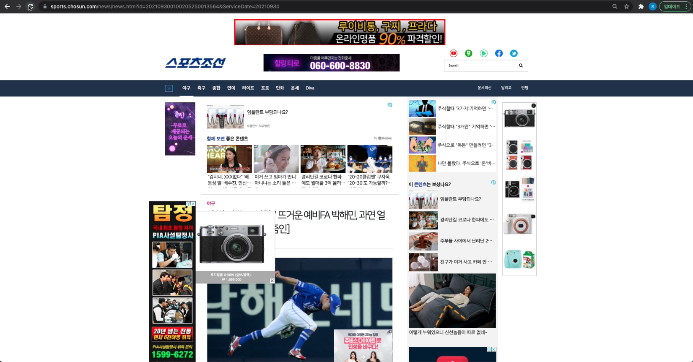
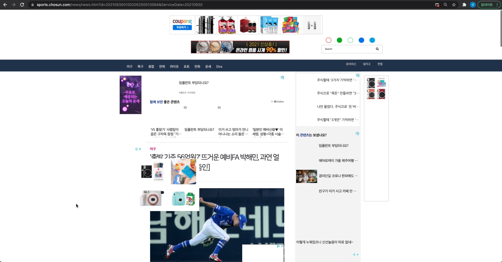
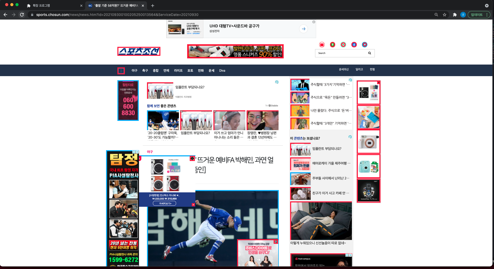

# Adblock_with_DeepNetwork
상명대학교 2021년 지도형 캡스톤디자인

# Team: AI는 처음이조
|이름|학번|역할|
|---|---|---|
|[이세인](https://github.com/juddy7453)|201710952|PM, 데이터 수집, 관리|
|[김경민](https://github.com/kyungmin123)|201610970|AI 모델 개발, 테스트 실행, 이미지 처리|
|[윤정연](https://github.com/yoouyeon)|201710947|Chrome Extension, API 개발, 배포|

# Project

## Purpose
기존 광고 차단 프로그램의 차단 원리는 각각 보유한 유해 웹 사이트 목록에 기재된 도메인을 무조건 차단하는 것이다.

'화이트 리스트' 기능을 제공하는 프로그램들도 있지만 이용자가 직접 특정 사이트들을 등록해야 한다. 이용자가 직접 자신이 원하는 몇몇 사이트만을 등록하여 차단 해제하는 것은 번거로운 일이다.

따라서 딥러닝 기법을 사용하여 이미지 자체를 가지고 광고인지, 아닌지 구분하는 기능을 가진 프로그램을 제작하고자 했다.

## Advantage
- 불필요한 광고 이미지가 제거되어 뉴스 기사 읽기에만 집중할 수 있다.
- 광고 사이트의 list가 변경되어도 일일이 갱신할 필요가 없어 유지 및 보수가 간편하다.
- 이후에 광고 이미지의 카테고리를 유의미한 정확도로 분류할 수 있게 되면 사용자가 카테고리에 따라 선택적으로 광고를 가릴 수 있는 기능을 추가하는 것으로 발전시킬 수 있다.

## Procedure
1. 광고/비광고 이미지를 수집, 특성에 따라서 9개의 카테고리로 분류하여 학습시킨다.
2. 크롬 확장프로그램을 실행시키고 스포츠 조선 기사 페이지에 접속한다.
3. 페이지의 이미지를 사용한 태그들에서 이미지 src를 수집한다.
4. 링크에서 이미지를 열어 모델에 입력한다.
5. 모델의 결과에 따라서 이미지를 가리거나, 유지한다.

## Result
### Before & After
#### 실행 전

#### 실행 후

### Demo Video

### Classification results
- 광고: 빨간색 테두리
- 광고가 아닌 것: 파란색 테두리

---

# Folder

[AI](https://github.com/kyungmin123/Adblock_with_DeepNetwork/tree/main/AI) : 모델 코드 저장소

[CHROME EXTENSION](https://github.com/kyungmin123/Adblock_with_DeepNetwork/tree/main/chrome_extension) : 크롬 확장 프로그램

[API](https://github.com/kyungmin123/Adblock_with_DeepNetwork/tree/main/API) : Deep Learning Model API

[Deep_learning_study](https://github.com/kyungmin123/Adblock_with_DeepNetwork/tree/main/Deep_learning_study) : 프로젝트 시작 전 사전 스터디 내용 기록

[DOCUMENT]() : 캡스톤디자인 관련 문서