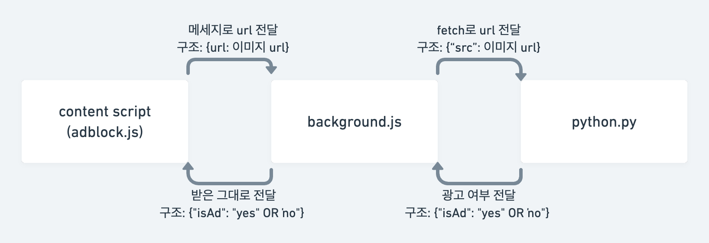

# 😫 read me... (21.04.10 ver)

## 🌟 확장 프로그램 적용 방법

1. 파일들을 로컬에 받아주세요. (지금은 로컬에서의 실행이 필요합니다..)
2. 크롬에서 chrome://extensions/ 로 접속
3. 오른쪽 상단에 개발자 모드 on
4. 왼쪽 상단에 **압축 해제된 확장 프로그램을 로드합니다** 클릭
5. **chrome_extension_ver_1.0** 폴더 선택
6. 적용 완료

## 🌟 확장 프로그램 실행 방법

😿 지금은 그냥 작동만 되는 수준이라 꼭 이 루틴을 맞춰서 실행시켜야만 제대로 실행이 됩니다! 나중에 좀 더 깔끔하게 되도록 기능 추가할게요..

0. [주피터 노트북에서의 플라스크 설치 및 실행 방법](https://bio-info.tistory.com/45) 참고해서 플라스크 설치 (이부분은 저보다 더 잘 아실 것 같아 자세한 설명은 패스합니다.. 🥲)

1. 확장 프로그램 off (지금은 모든 페이지에서 실행되기 때문에 동아일보가 아닌 페이지에서는 **꼭** 꺼주셔야 합니다.)
2. **chrome_extension_ver_1.0** 폴더 내의 python.py파일 실행 -> 로컬 서버 on
3. 동아일보 페이지로 이동
4. 확장 프로그램 on
5. 페이지 새로고침

## 🙆‍♀️ 현재까지 구현된 것

- 확장 프로그램...
- js와 python 연결
- 페이지 내의 이미지 태그들의 (전부는 아니지만) 정보 받기
- 이미지 링크 받아서 python 함수의 인자로 전달.
- python 함수의 반환값 js 파일로 전달

## 🙅‍♀️ 현재까지 구현하지 못한 것

- 서버 (현재는 직접 로컬 서버를 구동해야만 정상적으로 작동이 됩니다.)
- 일부 이미지들의 정보 받지 못함. (Div 태그의 background로 삽입되어있는 이미지들, iframe 내부의 일부 이미지들)
- 동아일보 도메인에서만 작동하도록 하는 것

---

## 📁 파일 설명

### manifest.json

크롬 확장프로그램에서 필요한 권한 같은 것들이 담겨있음.

### background.js

확장 프로그램 뒤쪽에서(?) 계속 실행되고 있는 스크립트.  
여기서는 adblock.js에서 메세지를 받아서 python.py로 전달하고, python.py에서 받은 응답을 adblock.js로 보내는 역할을 하고 있습니다.

### adblock.js

페이지가 완전히 로드될때마다 페이지 내부에 삽입되는 스크립트.  
페이지가 로드되면 페이지 내부의 img 태그들을 찾아내고, 각각의 src를 backgroud.js로 보내고, 받은 응답의 결과에 따라서 이미지를 안보이게 하는 역할을 하고 있습니다.

### python.py

로컬서버를 통해서 background.js에서 오는 요청을 받고 응답하는 파일.  
**이미지 소스를 받아서 광고 여부 판별하는 함수 추가 필요합니다!**

### [flow chart]

