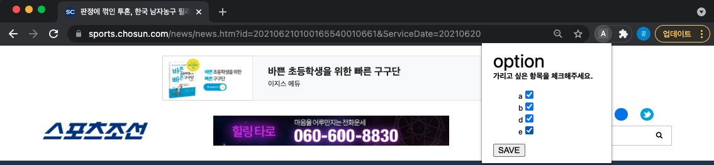
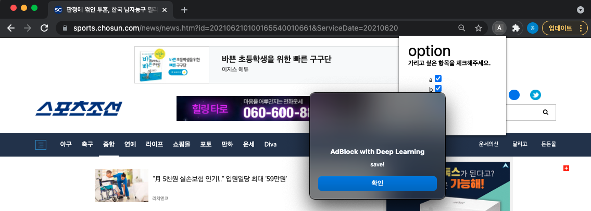

## 사용자 옵션 설정하는 방법

1. 기존 방법대로 확장 프로그램을 설치한 다음에 (chrome://extension -> 압축해제한 프로그램 -> program 폴더 클릭)

2. 설치가 되면 위에 퍼즐 모양의 확장 프로그램 버튼을 누르면 설치된 확장 프로그램 목록이 뜨고 거기에서 adblock with deeplearning 이 있어요. 그거 선택해주시면

   

3. 아래 스크린샷처럼 선택할 수 있는 팝업이 뜹니다. 거기에서 가릴 종류 선택해서 (초기값은 모두 가리는 것으로 설정되어 있습니다.) save 버튼 누르면 

   

4. save라는 팝업이 뜨면서 저장이 됩니다.

   

이렇게 선택한 사용자 옵션은 프로그램을 제거하지 않는 이상 계속해서 저장되어있기는 한데 옵션 창에서는 기본적으로 계속 체크 해제된 상태로 표시됩니다...

나중에 조금 여유있을 때 고치도록 하겠습니다ㅜㅜ