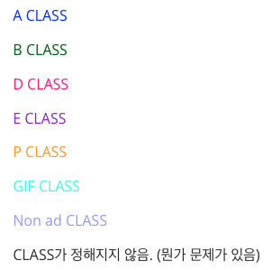

# 분류 결과 확인용 프로그램

실행 방법은 현재 이 폴더 안의 test program 폴더를 이전과 같은 방법으로 실행시키면 됩니다.

모델의 분류 결과에 따라 테두리를 설정하려고 했는데 뭔가 크기설정이 잘못되었는지 테두리가 좀 잘립니다.

색깔 구분은 어느정도 되어서 분류 결과 확인에는 문제가 없다고 판단해서 그냥 두겠습니다..

여유가 되면 보기좋게 수정하도록 하겠습니다.

## 결과 설명

분류 결과에 따라 테두리 색이 다릅니다.

외에 테두리가 표시되지 않는 이미지는 애초에 URL을 갖고 오지 못한 이미지들입니다.

